**What is AWS EC2 Instance?**

EC2 instance is just a virtual server in AWS’s data center. It provides a resizable compute capacity in the cloud. You can quickly scale it up and down as per your requirements changes.

**What is CICD ?**

In this guide we will build a code deploys setup that takes our commits from github repo for our source codes and deploys it automatically on our servers. CICD practices in the most simplest form. This guide will focus more on CICD practices.

This guide assumes that you have an intention of understanding how GitHub can be integrated into code deploy as a source.

# **Table of Contents:**

 
1. The Requirements

 
2. Create IAM Role

 
3. Create and Launch EC2 Instance

 
4. Installation of Apache Web

 
5. Install Mysql Database

 
6. Install Nodejs and NPM

 
7. Create Github Repository

 
8. Create Nodejs Project

 
9. Configure AWS CodeDeploy Service

 
10. Running the Complete Pipeline

### **1. The Requirements**

To create the CI/CD pipeline, make sure to create these accounts first:

* Go to Amazon Web Services Website. [link](https://aws.amazon.com/)
* Sign in to your AWS account using Root user if you don’t have account please create.
* For Sign In Click on My Account -> AWS Management Console.
* Create Github Account. [link](< https://github.com/join>)

### **2. Create IAM Role**

There are two types of role we need. one is EC2 instance role and CodeDeploy service role

***(i) EC2 Instance Role:***

IAM role for EC2 instances allows EC2 instances to call AWS services on your behalf and also we need to create one for code deploy

Select the IAM Services in the drop down list of aws services in your console

Go to roles -> create roles -> (choose the service that will use this role)EC2 -> next

In the search box search for ec2 role as in the image below

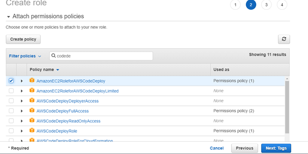

Click tags and fill in the details as you wish. In this case I will chose to leave the tags blank. Click next

Give it a Role name and leave description as it is then click create role.

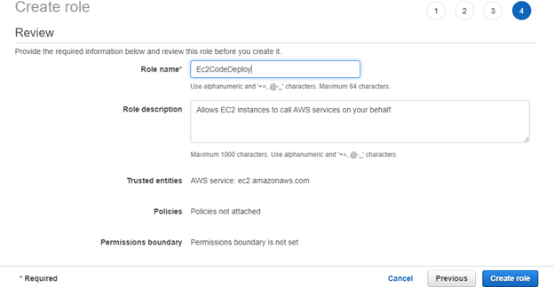

Click roles in the left panel and you should find the newly created role in the existing list

Navigate Navigate to the newly created role and click on it.

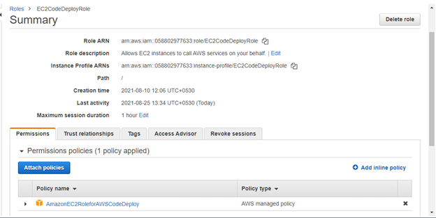

Click to trust relationship tap. (You can customize trust relationships by editing the following access control policy document).

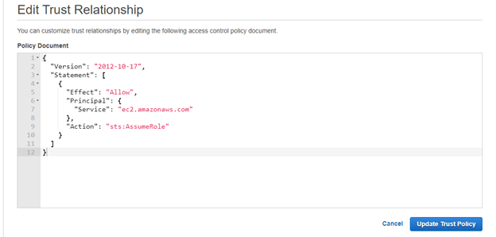

Once edited, click on **Update Trust Policy.**

> *We need to repeat the same process again but this time for code deploy to integrate with others aws services.*

***(ii) CodeDeploy Role:***

Select the IAM Service in the drop down list of aws services in your console

Go to roles -> create role > (choose the service that will use this tole) EC2 -> next

In the search box search for codedeploy as in the images below.

Create IAM for codeDeploy.

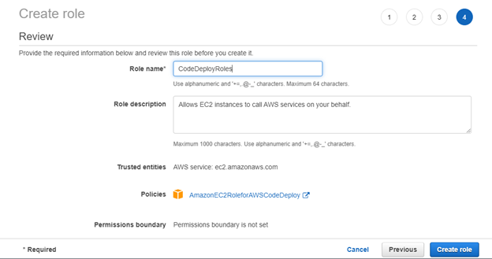

click roles in the left pane and you should find the newly created role in the existing list.

> So we have to set our policy with the same region as our ec2 instance we will be creating hence this syntax. So all we need to do is create our instances in the same region.

Navigate to the newly created role and click on it.

In Permissions tap click to attach policies -> add [AWSCodeDeployFullAccess](https://console.aws.amazon.com/iam/home#/policies/arn%3Aaws%3Aiam%3A%3Aaws%3Apolicy%2FAWSCodeDeployFullAccess)

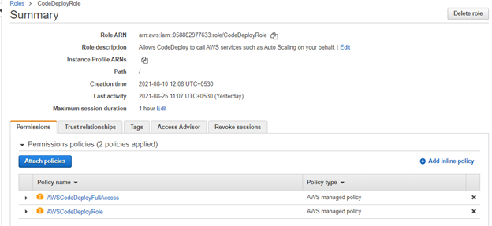

Click to trust relationship tap. (You can customize trust relationships by editing the following access control policy document.)

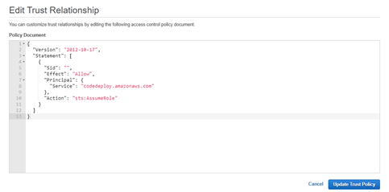

Once edited, click on **Update Trust Policy.**

All set! Now IAM roles are done.

### 3. Create and Launch EC2 Instance

* In this AWS EC2 Tutorial, let’s understand the whole EC2 instance creation process through a use case in which we’ll be creating an Ubuntu instance for a test environment
* **Select EC2 Services:** Click EC2 under compute section. This will take you to the EC2 dashboard.
* **Click lunch instance:**

**Step 1.** **Select an AMI:** because you require a Linux instance, in the row for the basic 64-bit Ubuntu AMI, click select.

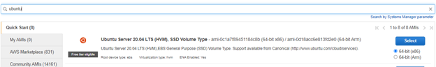

5. **Choose an Instance:**

Select t2.micro instance, which is free tire eligible

**Step 2:** choose an instance type.

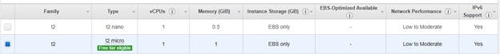

**6. Configure instance details:**

Configure all the details and then click on add storage.

**Step 3:** Select IAM role in the i am role drop down and choose your created EC2.

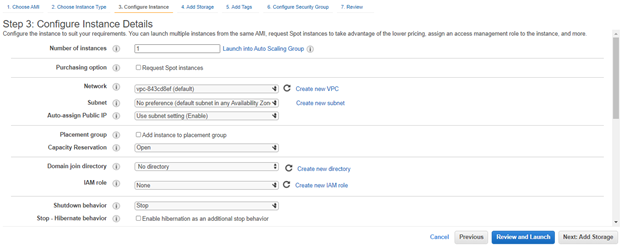

**7. Add storage:**

Add the storage size in the related fields for the instance.

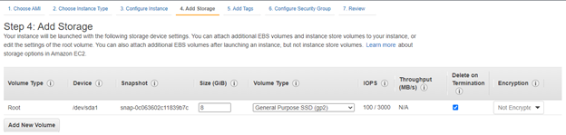

**8. Tag an instance:**

Type a name for your AWS EC2 instance in the value box. This name, more correctly known as a tag, will appear in the console when the instance launches. It makes it easy to keep of running machines in a complex environment. Use a name that you can easily recognize and remember.

**Step 5: Tag Instance**

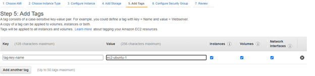

**9.** **Create a security group:**

**Step 6: Configure security group**

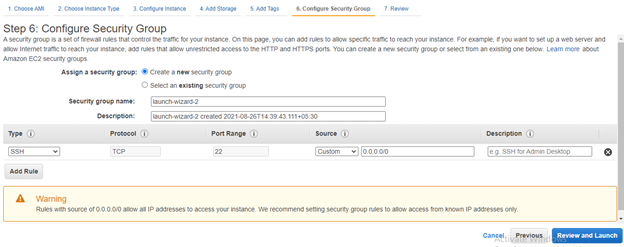

Open up SSH, HTTP and HTTPS — For SSH make sure to put in your specific address because we only want our ip to be to ssh inti our server. We can see a warning there that tells us its not save to make access privileges open to all ips

HTTP TCP 80 0.0.0.0/0

HTTP TCP 80 ::/0

SSH TCP 22 (YOUR IP ADDERSS)

HTTPS TCP 443 0.0.0.0/0

HTTPS TCP 443 ::/0

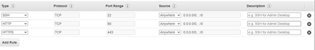

**10. Review and Launch:**

Click Review and Launch. You should already see your new instance in the list of running instances.

**11. Create a key pair & launch an instance:**

Next, in this AWS EC2 tutorial, select the option ‘create a new key pair’ and give a name of key pair. After, download it in your system and save it for future use.

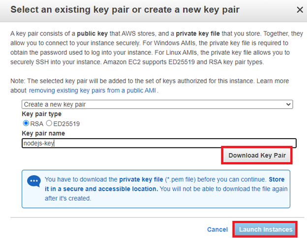

**12. Check the details of a launched instance.**

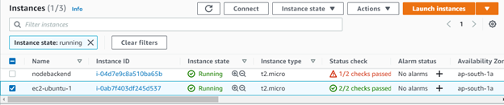

**13. Converting your private key using PuTTYgen**

Step1: Download and Install PuTTY ([link](https://www.putty.org/)).

PuTTY does not natively support the private key format (.pem) generated by Amazon EC2. PuTTY has a tool called PuTTYgen, which can convert keys to the required PuTTY format (.ppk). You must convert your private key into this format (.ppk) before attempting to connect to your instance using PuTTY.

Click Load. By default, PuTTYgen displays only files with the extension .ppk. To locate your .pem file, select the option to display files of all types.

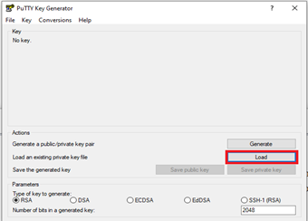

* Select your .pem file for the key pair that you specified when you launch your instance, and then click Open. Click OK to dismiss the confirmation dialog box.
* Click Save private key to save the key in the format that PuTTY can use. PuTTYgen displays a warning about saving the key without a passphrase. Click Yes.
* Specify the same name for the key that you used for the key pair (for example, my-key-pair). PuTTY automatically adds the .ppk file extension.

**14. connect to EC2 instance using SSH and PuTTY.**

* Open PuTTY.exe
* In the Host Name box, enter Public IP of your instance.
* In the Category list, expand SSH.
* Click Auth (don’t’ expand it).
* In the private key file for authentication box, browse to the PPK file that you downloaded and double-click it.
* Click Open.
* Then put server user name.

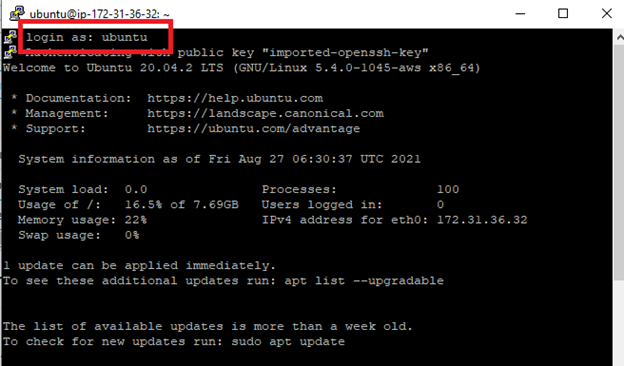

### 4. Installation of Apache Web:

**What is web server?** *First, we need to understand the different kinds of servers. The server where our database runs is called as a database server. The server we use for sending mails is called as a mail server. These are some examples of servers. Now we can start with what is the Web Server? Web server is used to serve content of websites over the network. When user request for any contest from the server, web server pulls the content from the server and delivers it to the web.*

**What is Apache Web Server?** *Apache is an open source web server which is available to use for free. It’s a most widely used web server in Linux OS, but it can be used on Windows as well. It allows users to get content on the web served by the server. We call it a web server, but it’s not a physical server, rather it’s an application that runs on the actual server.*

**Step 1 — Installing Apache:**

Apache is available within Ubuntu’s default software repositories, making it possible to install it using conventional package management tools.

Let’s begin by updating the local package index to reflect the latest upstream changes:

> $ sudo apt update

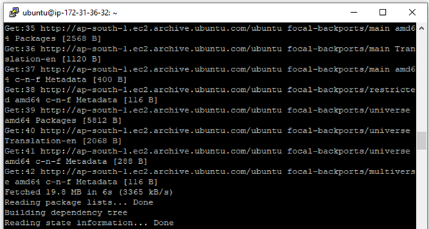

Update Completed.

Then, install the `apache2` package:

> $ sudo apt install apache2

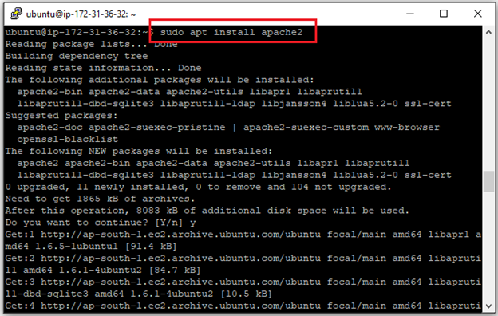

After confirming the installation, apt will install Apache and required dependencies.

**Step 2 — Adjusting the Firewall:**

Before testing Apache, it’s necessary to modify the firewall settings to allow outside access to the default web ports. Assuming that you followed the instructions in the prerequisites, you should have a UFW firewall configured to restrict access to your server.

During installation, Apache registers itself with UFW to provide a few application profiles that can be used to enable or disable access to Apache through the firewall.

> $ sudo ufw app list

You will receive a list of the application profiles:

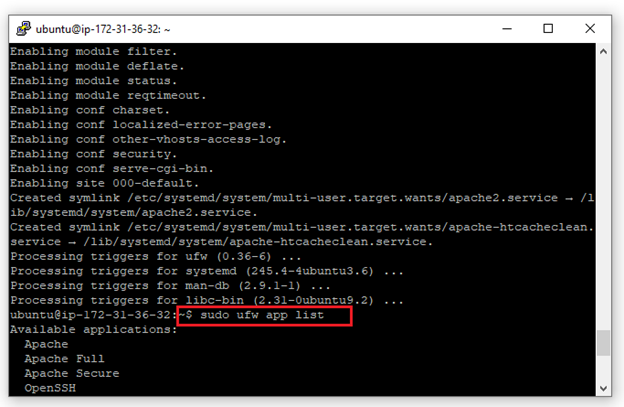

As indicated by the output, there are three profiles available for Apache:

* **Apache**: This profile opens only port 80 (normal, unencrypted web traffic)
* **Apache Full**: This profile opens both port 80 (normal, unencrypted web traffic) and port 443 (TLS/SSL encrypted traffic)
* **Apache Secure**: This profile opens only port 443 (TLS/SSL encrypted traffic)

It is recommended that you enable the most restrictive profile that will still allow the traffic you’ve configured. Since we haven’t configured SSL for our server yet in this guide, we will only need to allow traffic on port 80:

> $ sudo ufw allow Apache

You can verify the change by typing:

> $ sudo ufw status

The output will provide a list of allowed HTTP traffic:

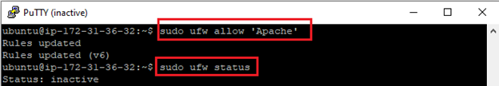

As indicated by the output, the profile has been activated to allow access to the Apache web server.

> $ sudo systemct1 status apache2

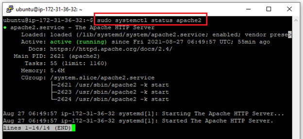

As confirmed by this output, the service has started successfully. However, the best way to test this is to request a page from Apache.

You can access the default Apache landing page to confirm that the software is running properly through your IP address.

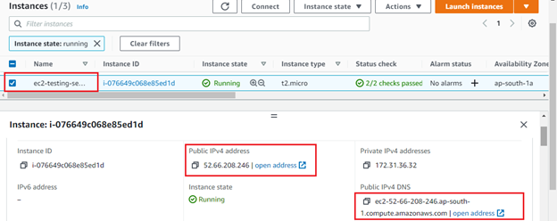

When you have your server’s IP address, enter it into your browser’s address bar:

> http://your_server_ip

You should see the default Ubuntu 20.04 Apache web page:

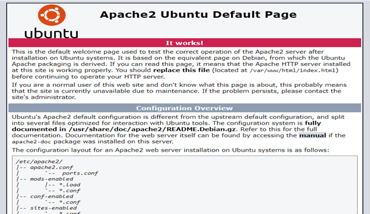

* If you see the above page, it means your Apache server is working fine.

**Step 5 — Setting Up Virtual Hosts:**

When using the Apache web server, you can use *virtual hosts* to encapsulate configuration details and host more than one domain from a single server. We will set up a domain called **your_domain_name**, but you should **replace this with your own domain name**.

Apache on Ubuntu 20.04 has one server block enabled by default that is configured to serve documents from the `/var/www/html` directory. While this works well for a single site, it can become unwieldy if you are hosting multiple sites. Instead of modifying `/var/www/html`, let’s create a directory structure within `/var/www/html` for a **your_domain_name** site, leaving `/var/www/html` in place as the default directory to be served if a client request doesn’t match any other sites.

I am create one folder for test_nodejs_application

We going to specific path cd /var/www/html/

/var/www/html mkdir test_nodejs_application

Mkdir test_nodejs_application

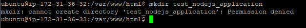

I try to create folder but getting error for cannot create directory. So we need to permission access.

> ls -1 /var/www
>
> sudo usermod -a -G www-data ubuntu
>
> exit

step1: sudo chown -R ubuntu:www-data /var/www

step2: sudo chmod 2775 /var/www

step3: find /var/www -type d -exec sudo chmod 2775 {} ;

step4: find /var/www -type f -exec sudo chmod 0664 {} ;

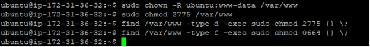

Again follow these steps.

We going to specific path cd /var/www/html/

> /var/www/html mkdir test_nodejs_application

successfully created.

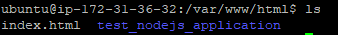

Alright now our Apache setup. let’s go to install Mysql database.

### 5. Install Mysql Database:

**Step 1 — Installing MySQL:**

On Ubuntu 20.04, you can install MySQL using the APT package repository. At the time of this writing, the version of MySQL available in the default Ubuntu repository is version 8.0.19.

To install it, update the package index on your server if you’ve not done so recently:

> $ sudo apt update

Then install the mysql-server package

> $ sudo apt install mysql-server

This will install MySQL, but will not prompt you to set a password or make any other configuration changes. Because this leaves your installation of MySQL insecure, we will address this next.

**Step 2 — Configuring MySQL:**

For fresh installations of MySQL, you’ll want to run the DBMS’s included security script. This script changes some of the less secure default options for things like remote root logins and sample users.

Run the security script with `sudo`:

> sudo mysql_secure_installation

This will take you through a series of prompts where you can make some changes to your MySQL installation’s security options. The first prompt will ask whether you’d like to set up the Validate Password Plugin, which can be used to test the password strength of new MySQL users before deeming them valid.

If you elect to set up the Validate Password Plugin, any MySQL user you create that authenticates with a password will be required to have a password that satisfies the policy you select. The strongest policy level — which you can select by entering 2 — will require passwords to be at least eight characters long and include a mix of uppercase, lowercase, numeric, and special characters:

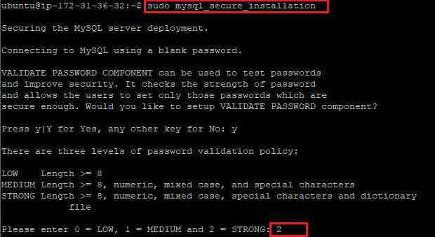

Regardless of whether you choose to set up the Validate Password Plugin, the next prompt will be to set a password for the MySQL **root** user. Enter and then confirm a secure password of your choice:

Note that even though you’ve set a password for the **root** MySQL user, this user is not currently configured to authenticate with a password when connecting to the MySQL shell.

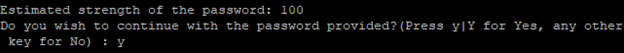

From there, you can press `Y` and then `ENTER` to accept the defaults for all the subsequent questions. This will remove some anonymous users and the test database, disable remote root logins, and load these new rules so that MySQL immediately respects the changes you have made.

Once the script completes, your MySQL installation will be secured. You can now move on to creating a dedicated database user with the MySQL client.

**Step 3 — Creating a Dedicated MySQL User and Granting Privileges:**

Upon installation, MySQL creates a **root** user account which you can use to manage your database. This user has full privileges over the MySQL server, meaning it has complete control over every database, table, user, and so on. Because of this, it’s best to avoid using this account outside of administrative functions. This step outlines how to use the **root** MySQL user to create a new user account and grant it privileges.

> Mysql> sudo mysql

Once you have access to the MySQL prompt, you can create a new user with a `CREATE USER` statement. These follow this general syntax:

> Mysql> show databases;

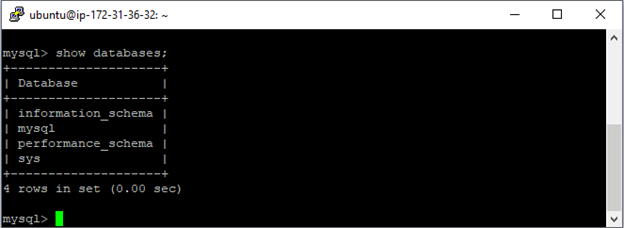

> Mysql> use mysql;

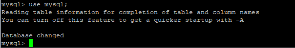

> Mysql> ALTER USER ‘root’@’localhost’ IDENTIFIED WITH mysql_native_password BY ‘password’;

Once you alter your root user password.

> Mysql> CREATE USER ‘username’@’localhost’ IDENTIFIED WITH mysql_native_password BY ‘password’;

After CREATE USER, you specify a username. This is immediately followed by an @ sign and then the hostname from which this user will connect. If you only plan to access this user locally from your Ubuntu server, you can specify localhost. Wrapping both the username and host in single quotes isn’t always necessary, but doing so can help to prevent errors

After creating your new user, you can grant them the appropriate privileges. The general syntax for granting user privileges is as follows:

> Mysql> GRANT ALL PRIVILEGES ON \*.\* TO username@’localhost’ WITH GRANT OPTION;

Create database.

> Mysql> create database <database_name>

Ex: Im creating test_database;

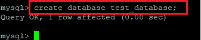

> Mysql> show databases;

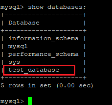

After creating your new database, you can grant them the appropriate privileges. The general syntax for granting user privileges is as follows:

> Mysql> GRANT ALL PRIVILEGES ON database_name.* TO ‘username’@’localhost’;

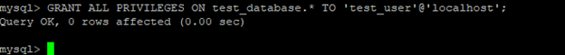

Following this, it’s good practice to run the `FLUSH PRIVILEGES` command. This will free up any memory that the server cached as a result of the preceding `CREATE USER` and `GRANT` statements:

> Mysql> FLUSH PRIVILEGES;
>
> Mysql> exit
>
> Mysql> mysql –u test_user –p

The `-p` flag will cause the MySQL client to prompt you for your MySQL user’s password in order to authenticate.

Finally, let’s test the MySQL installation complete.

### 6. Install Nodejs and NPM:

**Introduction**

[Node.js](https://nodejs.org/) is a JavaScript runtime for server-side programming. It allows developers to create scalable backend functionality using JavaScript, a language many are already familiar with from browser-based web development.

* using apt to install the nodejs package from Ubuntu’s default software repository

To get this version, you can use the `apt` package manager. Refresh your local package index first by typing:

> $ sudo apt update

Then install Node.js

> curl -fsSL <https://deb.nodesource.com/setup_current.x> | sudo -E bash –
>
> sudo apt-get install -y nodejs

Check that the install was successful by querying `node` for its version number:

> node –version

If the package in the repositories suits your needs, this is all you need to do to get set up with Node.js. In most cases, you’ll also want to also install `npm`, the Node.js package manager. You can do this by installing the `npm` package with `apt`:

> $ sudo apt install npm
>
> npm –version

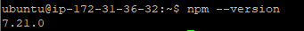

This will allow you to install modules and packages to use with Node.js.

At this point you have successfully installed Node.js and npm using apt and the default Ubuntu software repositories.

### 7. Create Github Repository

Login your github account. after create new projects.

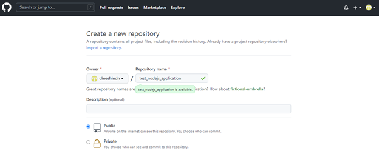

Fill in the required information in the above page, the repository get created with README.md and click create repository to get the repository created.

Once it is done, you will be able to see something like this:

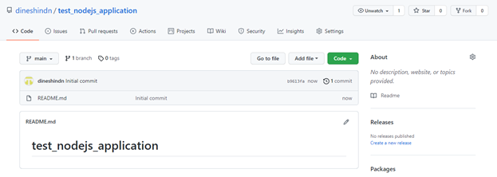

We have successfully created the repository!

### 8. Create Nodejs Project:

**Install Node.js for your local platform**

The first step is to get yourself an instance of the JavaScript runtime up and running on your local machine

> sudo apt install node js

Initialize your project and link it to npm

> sudo apt install npm

Open a command prompt and type:

create a folder for your app

> $ mkdir test_nodejs_application

On terminal/commandline go to the folder created from previous step

> cd test_nodejs_application

**Initialize node project :**

Running this command initializes your project:

> npm init

This creates a *package.json* file in your *test_nodejs_application* folder. The file contains references for all npm packages you have downloaded to your project. The command will prompt you to enter a number of things.

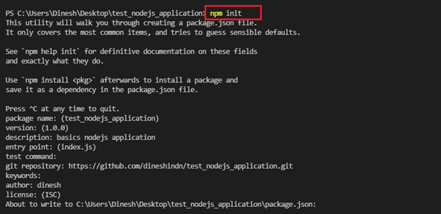

Install express framework, mySql, and body-parser

> $ npm i express
>
> $ npm install mysql2
>
> $ npm install body-parser

Create app.js file

**MySQL DB Setup:**

Prerequisite: Install mySQL Community Edition

**Create a DB:**

CREATE DATABASE test_database;

Create table:

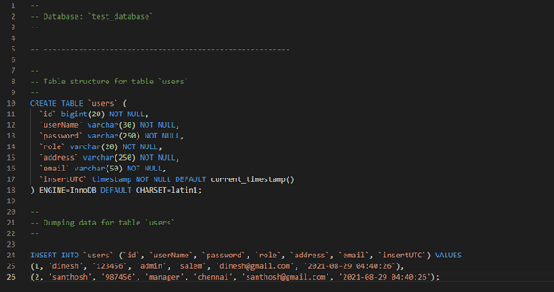

Create new folder named app and inside app create additional folders named controller, routes.

* Inside controller create new file named modules/index.js
* Inside routes create new file named routes/index.js

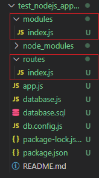

**Setting up the routes:**

Routing refers to determining how an application responds to a client request for a specific endpoint, which is a URI (or path) and a specific HTTP request method (GET, POST, PUT,PATCH,DELETE)

Each of our routes has different route handler functions, which are executed when the route is matched.

Routes/index.js

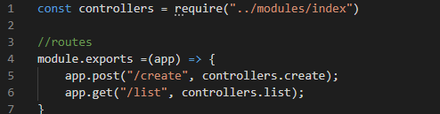

Let’s create a db connection wrapper, this will allow you to create connection on db which stored on a single file and can be reuse by other modules.

To do this create a new file name database.js

**Database.js**

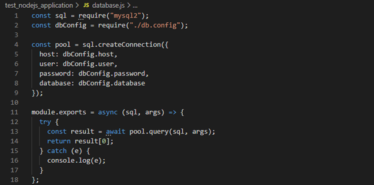

Db.config.js

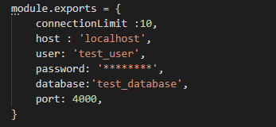

Modules/index.js file

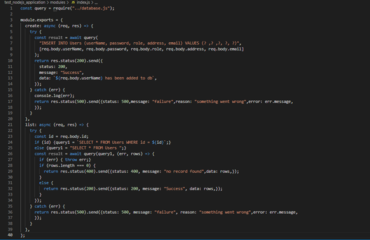

Earlier on, we had a minimal code for our server to be up and running in the app.js file.\
In this section we will be connecting our handlers(modules), database, body parser and the created routes together.\
Open the app.js file created a while ago and follow the following steps to put everything together.\
Essentially, you will be replacing the code in your app.js with the code snippet from this section

use bodyParser Parse incoming request bodies in a middleware before your handlers, available under the req.body property. It exposes various factories to create middle wares. All middle wares will populate the req.body property with the parsed body, or an empty object ({}) if there was no body to parse (or an error was returned).

Register our created routes in the app\
On app.js would have code below:

This will start server and any changes made to the code will restart the server

> $ npm start

or

> $ node app.js

This will start app.js

Now that everything is now connected, let’s test each of the routes and the respective methods.

Open your postman and type:

1. [http://localhost:4000/create](http://localhost:3000/create) in the enter request URL section and press enter.
2. On the same address, change the method to POST, click body and select “raw” and on the drop\
   menu choose application/json.

3. http://localhost:4000/list in the enter request URL section and press enter.

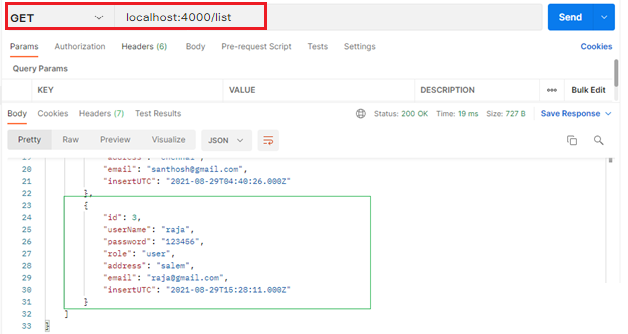

**Database report**

**Create a YAML file:**

Create a **YAML** file with the configured that your build pipeline will use. This will be custom to your requirements.

**appspec.yml**

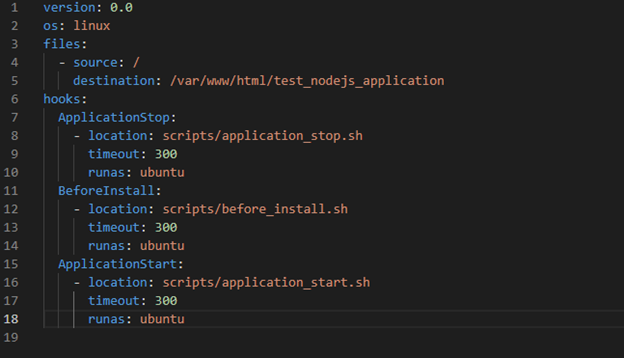

**file:** Script/application_start.sh

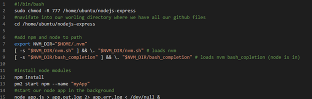

**file:** Script/application_stop.sh

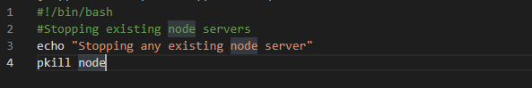

**file:** Script/before_install.sh

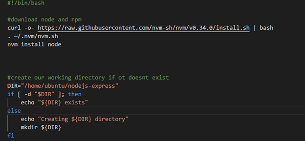

Create database migration setup:

create **migration.js** file

add require to **app.js** file.

\#set a new remote

> git init
>
> git remote add <https://github.com/dineshindn/test_nodejs_application.git>

\#Verify new remote

> git remote -v

> git add .
>
> git commit -m “add your commit”
>
> git push

Awesome, we have created a nodejs application. Let's configure our application with AWS CodeDeploy Service.

### 9. Configure AWS CodeDeploy Service

To configure CodeDeploy , first I need to create an IAM Role that will allow the service to manage EC2 instances.

Then I have to create a new CodeDeploy application, that will be my deploy target.

**Create Deployment IAM Role:**

From AWS, go to IAM section (Identity Access Management) and select “Roles” and then “Create Role”

Already created these things

Select services navigate to “CodeDeploy”.

**Create CodeDeploy Application**

Click on create application

CodeDeploy is a service that will communicate with Pipeline later. There are 2 modules that must be prepared, namely Application and Deployment Group. First, we go to the CodeDeploy service. Click Create Application then enter the desired application name and on the Compute Platform menu select EC2 / On-premises.

Configure your app name and select Amazon EC2 on compute platform, and click on create again.

You will see this screen:

After creating the application, I need to create a “Deployment Group”.

I name the deployment group **test_nodejs_application_group** and select as ‘**Service Role**” the IAM role created in the previous step.

Select In-Place as deployment type , and my Auto Scaling group as Environment configuration.

Finally , I leave the Deployment settings to “AllAtOnce” and disable load balancing , as I will not require it for this project. Hit Create to finish this step.

**Deploy stage on the pipeline:**

Click pipeline and create new pipeline.

Let’s go back to the CI/CD pipeline , select “Edit” and “+Add stage” , naming it “Deploy”.

Next, on the “Deploy” stage I add an “Action Group”, which will contain deploy steps. On the Action creation form, name it “Deploy” and select “AWS CodeDeploy” as provider.

Step1 : create pipeline name and choose new service role and click next.

Step2: add source stage:

Select github version 2

Click connect to github

Add connection name.

Then connect to github.

click install a new app. select github repository

After complete this section. redirect to your codeDeploy services.

select repository name and branch name. click next

Then go to **add build stage**.

skip this stage. because dont need to nodejs application.

**Go to add deploy stage.**

step1: Select Deploy Provider

step2: Application Name: select codeDeploy name

step3: Deployment Group: select codeDeploy group name and click next.

Then redirect to pipeline services.

**Congratulations ! our CI/CD is now working.**

### 10. Running the Complete Pipeline

You now can access your web app via IPv4 Public IP (you can find it from your EC2 Instance page in the description)

**Checking chrome Browser:**

**Checking Postman:**

<http://13.233.149.247:4000/list> ther the URL

[http://13.233.149.247:4000/](http://13.233.149.247:4000/list)create ther the URL

**There you go! Now you have a highly scalable NodeJS Application that is fully automated using AWS CodePipeline.**

### Conclusion

I hope this blog has been informative to you all. I have tried as much as possible to make this blog look like a story because the main purpose of writing it is to show you the many challenges DevOps Engineers and Developers face to set up this solution and the various ways used to solve it. I will not stop updating this project and will make sure it has an improvement plan because I know it can even be better!

### See More:

* [Deploy a Node JS Web app](https://aws.amazon.com/getting-started/hands-on/deploy-nodejs-web-app/)