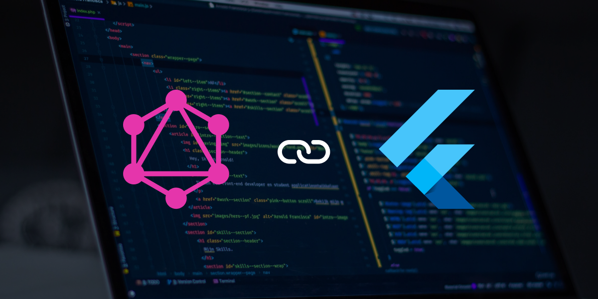

.

**GraphQL** is an  open-source data query and manipulation language  created by Facebook for APIs. It is used to precisely fetch only the required data working as an improvement of RestAPIs that does overfetching.

**Stacked** is a simple to use, highly scalable, flexible and easily maintainable and testable Flutter MVVM(Model-View-ViewModel) architecture.

Previously known as the provider architecture, you begin to implement the stacked architecture on a flutter application by adding the libraries: [Stacked](https://pub.dev/packages/stacked) , [Stacked_services](https://pub.dev/packages/stacked_services). The stacked_services library, helps in implementing the stacked architecture, while the stacked library is the architecture itself.

The stacked architecture consists of 3 major aspects:

* ***View :*** Displays the UI to the user.
* ***ViewModel:*** Manages the business Logic, state of the view and other logic required by the users.
* ***Services:*** It wraps all the shared functionalities or feature sets e.g  database functionality, integrating APIs, and share data transfer between viewModels.

 Services in the stacked architecture are registered and shared with the 'get_it' service locator. Example, as shown below:-

> Remember to import the [get_it](https://pub.dev/packages/get_it) package and initiate a get_it instance.

```
final GetIt locator = GetIt.instance;

class LocatorInjector {
  static Future<void> setUpLocator() async {
    locator.registerLazySingleton(() => AssetService());
      }
    }
```

The get_it service locator is assigned to a global variable 'locator' which  is used to initiate the required service either on different service screens or viewModel to allow sharing of methods in that service.  For instance :-

```
AssetService? _assetService = locator<AssetService>();
```

From this, it will be very easy to pass on data returned from the integrated APIs found in the services to the view model.

**Integrating GraphQL APIs.**

In order to successfully integrate GraphQL Apis to your application, you have to first ensure that the endpoints are working well i.e returning the required data/schemas; based on queries or mutations passed. To do this, you can use a free software created by Facebook called the GraphiQL. You can download it here: [Link](https://www.electronjs.org/apps/graphiql)

This software allows you to pass the graphql endpoint link, specific queries, input required headers and view the response/ schemas.


To fetch data from a graphql endpoint, you need to install the [graphql_flutter](https://pub.dev/packages/graphql_flutter) plugin to the pubspec.yaml file. This plugin provides APIs and widgets that allows you to fetch and use data from a Graphql backend. They include:

* **httpLink:**  sets the graphQL endpoint or URL.
* **graphQLClient :** connects the graphQL endpoint to the graphql server. Used to fetch query/mutation.
* **graphQLCache :** it is used to store the queries and mutations.
* **graphQLProvider:** it wraps the query and mutation widgets in order to use the client. it is recommended to wrap the Material App with graphQLProvider.
* **query:** widget used to make queries to the graphQL endpoint.
* **mutation**: widget used to make mutations on the graphQL backend.
* **subscription:** this is used to setup subscription on the data received from the backend.

In our example for this article on integrating graphql in a flutter app, we will look at how to setup a graphql client using dio, through this client, we will connect to the graphql server.

> **Dio** is a powerful http client for dart which supports interceptors, global configuration. FormData, request cancellation, file downloading, and timeout.

To install dio in your application, you need to add the [dio](https://pub.dev/packages/dio) plugin and to use graphql with dio you need to add the [gql_dio_link](https://pub.dev/packages/gql_dio_link) plugin  to the pubspec.yaml file,

Below is a code sample on how to create a graphql client using dio:

```
 final client = dio.Dio();
 static final graphqlEndpoint =
      ".../1.0/graphql";
      
 final Link link = DioLink(
        graphqlEndpoint,
        client: client,
        defaultHeaders: {
          "content-type": "application/json",
          "service": "in-vfleet-uf-webapi",
          "Accept": "application/json",
          "Authorization": "bearer " + token,
        
        },
      );
      final res = await link
          .request(Request(
            operation: Operation(document: gql.parseString(query!)),
          ))
          .first;

      return res;
```

There are variables that need to pass for the connection to the server to be successful and that is; the appropriate graphql endpoint ,the client which is a dio client, the default headers and the appropriate query to be passed.

**The graphql architecture/ flow**

* **Step 1:** The graphql query is sent to the server by the client as a string format. The string format looks like the shape of the respective JSON, this including the variables needed to be passed.
* **Step 2:** The server then extracts the query string, validates and processes it as per the graphQL Schema.
* **Step 3:** The graphQL API Server then makes calls to a database to fetch the requested data.
* **Step 4:** The server then returns the requested data to the client as a JSON Object.

**Queries - Fetching Data**

Fetching data from a graphql server you need to write a specific query in relation to the schema/ database you want to fetch the data from. You can then test the queries if they are well written for the specific data using the GraphiQL tool.

An example of a simple query  fetching the users name and id from a database is as follows:

```
query {
   users {
     id
     name
   }
 }
```

Queries can also have variables assigned to  them, for example the query for fetching accountHierarchy data has targetcustomeruid and toplevelsonly variables, and this can be done as follows:

> kindly note you can also pass the variables dynamically by storing the returning the query in a function that passes the variables as parameters.

```
query {
accountHierarchy(targetcustomeruid:"",toplevelsonly:"true"){
  userUid,
  customers{
    customerUid,
    customerType,
     customerCode,
    displayName
    name,
    children{
      customerUid
    }
  }
}
}
```

To pass the query as stated early is done in a string format. Following the stacked architecture for a flutter application, all queries are saved in the service class making it easy to be called when passed on to client. You can store the query in a string variable for easy calling of the query An example of a query passed as a string:

```
String getAccountHierarchyData = """query {
accountHierarchy(targetcustomeruid:"",toplevelsonly:"true"){
  userUid,
  customers{
    customerUid,
    customerType,
     customerCode,
    displayName
    name,
    children{
      customerUid
    }
  }
}
}"""
```

**Mutation - Modify Data**

Mutations are often used for inserts, updates and deletion of data in the database and return a JSON object as value.

To perform insertion, there has to be an existing database to which the insertion is performed. For example, Tasks here is an existing database. Insertions also do take in several variable i.e the data being passed as shown below:

```
mutation InsertTask($date: date, $name: String, $tasks_id: uuid) {
  insert_Race(objects: [{date: $date, name: $name, tasks_id: $season_id}]) {
    returning {
      name
    }
  }
}
```

You can also pass all the different types of mutations similarly as how it is done in queries, as  strings, especially when using the stacked architecture, having defined the GraphQLClient as follows:

> Remember to declare the required parameters to be passed in the mutation.

```
 editSaveData = """mutation{
  updateNotificationReport(reportUid:"$reportUid",
    reportPeriod:1,
    emailSubject:"$emailSubject",
    emailRecipients:$emailRecipients ,
    queryUrl:"$queryUrl",
    emailContent:"$emailContent",
    assetFilterCategoryID:1,
    allAssets:false,
    filterTag:[],
    filterOptions:[],
    svcbodyJson:$svcbodyJson  
    reportTitle:"$reportTitle",
    reportEndDate:"$reportEndDate",
  ){
    status,
    reqId
  }
}""";
```

The above mutation will return a status and requestId.

For deletion is also passed similar to the update and insertion as a string as follows:

> The values uid and utc are variables passed dynamically to identify the entity being deleted.

```
 var data = """
mutation{
  NotificationReportDelete(
    geofenceuid:"$uid",
  actionutc:"$utc")
}""";
```

**Subscription - Listen To Data**

GraphQL  subscriptions are subscription queries set to a websocket endpoint that returns data from the server continuously whenever data changes on the backend.

Subscriptions are often used where live data is required. There are often triggered by constant updates of the database through mutation and the easiest way to show live data on a flutter app UI is using the subscription widget.

To create a subscription you can do it as follows:

```
static String fetchLiveRequests= """
   subscription fetchLiveRequestData {
   live_requests {
     user {
       name
       time
     }
   }
 }
 """;
```

You can then listen to the requested data using subscription widget as below:

```
Subscription(
  options: SubscriptionOptions(
    document: gql(
      OnlineFetch.fetchLiveRequests,
    ),
  ),
  builder: (result) {
    if (result.hasException) {
      return Text(result.exception.toString());
    }
    if (result.isLoading) {
      return Center(
        child: const CircularProgressIndicator(),
      );
    }
    return Expanded(
      child: ListView.builder(
        itemCount: onlineList.list.length,
        itemCount: payload['live_requests'].length,
        itemBuilder: (context, index) {
          return Card(
            child: ListTile(
              title: Text(onlineList.list[index]),
              title: Text(payload['live_requests'][index]['user']['name']),
            ),
          );
        },
      ),
    );
  },
),
```


**Conclusion:**

This blog is targeted to Flutter developers especially those looking to integrate graphQL endpoints using Stacked architecture and Dio. I hope it has been beneficial to you, as you continue with your learning journey; Happy Coding!!


For more resources on graphql check out the following link:

* <https://hasura.io/learn/graphql/flutter-graphql/introduction/>