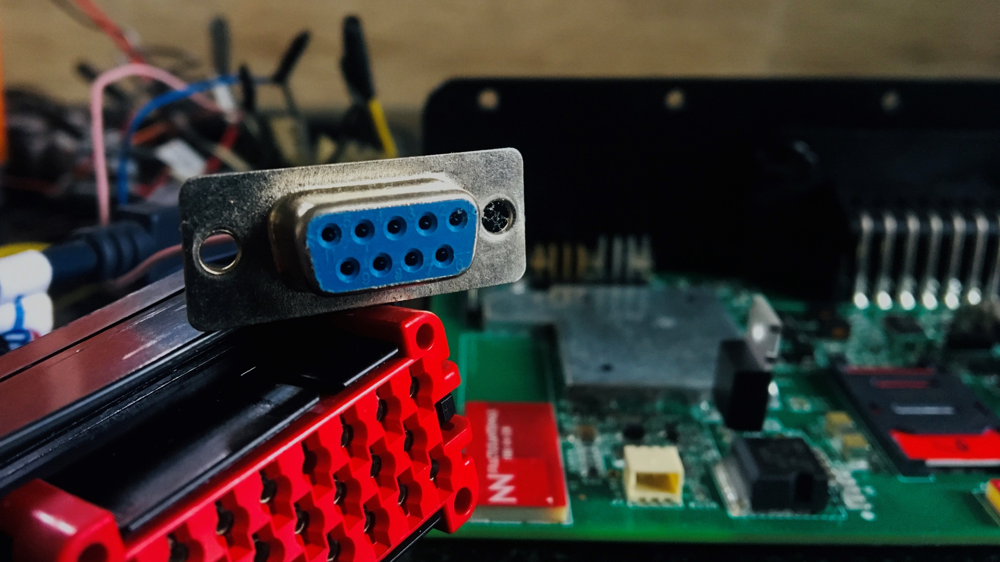
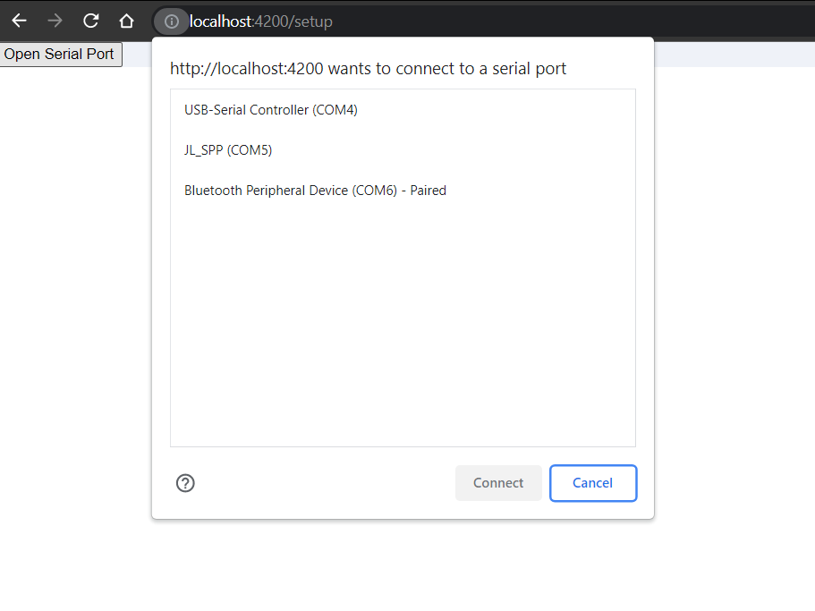
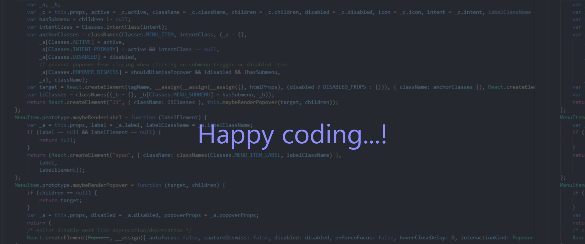

A serial port is a bidirectional communication interface that allows sending and receiving data byte by byte. 

 Web Serial API bridges the web and the physical world by allowing websites to communicate with serial devices, such as microcontrollers, 3D printers, removable USB, and Bluetooth devices that emulate a serial port.

### Using the Web Serial Port APIs

##### In this article, you will learn:

* Open the serial port connection with desired baud rate.
* Read the data from the serial port.
* Write the data to the serial port.
* Then finally, close the connected serial port connection.

##### You will need the below prerequisites,

* Basic knowledge of HTML, CSS, JavaScript, and ReactJS. 
* A recent version of Chrome (v80 or latest).
* A communication device (microcontroller/removable USB/ Bluetooth device).

### Feature Support Detection:

First, we need the check if the web serial port is supported, use: 

```javascript
if ("serial" in navigator) {
  console.log("Awesome, The serial port is supported.")
  // The Web Serial API is supported.
}
```

If the above block is working, then we can continue with the read from and write data on a serial port.

### Open a Serial Port:

To open a serial port, first, we need to access the ***`SerialPort`*** object. This will prompt the user to select a single serial port by calling ***`navigator.serial.requestPosrt()`*** in the response to a user can gesture such as touch or, mouse click, or pick one from the `navigator.serial.getPorts()` which returns a list of serial ports the website has been granted to access.

From the below options user can select one of the ports,



```javascript
document.querySelector('openSerialPort').addEventListener('click', async () => {
  //The Prompt will open to user to select's any serial port.
  const port = await navigator.serial.requestPort(); 
});
```

To get the list of serial ports, use: 

```javascript
// Get all serial ports the user has previously granted the website access to.
const ports = await navigator.serial.getPorts();
```

Calling ***`requestPort()`***  prompts the user to select a device from the list and it returns a ***`SerialPort`*** object. Once we have a ***`SerialPort`*** object, then calling ***`port.open()`*** with desired baud rate, it will open the port.  The baud rate specifies how fast the data is sent over the serial line. It is expressed in units of bits-per-seconds(bps).

```javascript
// Prompt user to select any serial port.
const port = await navigator.serial.requestPort();

// Wait for the serial port to open.
await port.open({ baudRate: 9600 });
```

You can also specify any of the options below when opening a serial port. The options are optional,

* **dataBits**: The number of data bits per frame (either 7 or 8).
* **stopBits**: The number of stop bits at the end of a frame (either 1 or 2).
* **bufferSize**: The parity mode (either "none", "even", or "odd").
* **parity**: The size of the read and write buffer that should be created (must be less than 16MB). 
* **flowControl**: The flow control mode (either "none" or "hardware").

### Read from a serial port:

All the Inputs and Outputs Streams in the web Serial port are handled by the Streams API.

After the serial port connection is established, the ***`readable`*** and ***`writable`*** properties from the ***`SerialPort`*** object return a [ReadableStream](https://developer.mozilla.org/docs/Web/API/ReadableStream) and a [WritableStream](https://developer.mozilla.org/docs/Web/API/WritableStream). Those will be used to receive data from and send data to the serial device. Both use ***`Unit8Array`*** instances for data transfer.

When new data arrives from the serial device, ***`port.readable.getReader().read()`*** returns two properties asynchronously: the ***`value`*** and a ***`done`*** boolean. If ***`done`*** is true, the serial port has been closed or no more data is coming in. Calling ***`port.readable.getReader()`*** creates a reader and locks ***`readable`*** to it. While ***`readable`*** is [](https://streams.spec.whatwg.org/#lock)locked, the serial port can't be closed.

```javascript
// Listen to data coming from the serial device.
const reader = port.readable.getReader();
while (true) {
  const { value, done } = await reader.read();
  if (done) {
    // Allow the serial port to be closed later.
    reader.releaseLock();
    break;
  }
  // value is a Uint8Array.
  console.log(value);
}
```

Some non-fatal serial port read errors can happen under some conditions such as buffer overflow, framing errors, or parity errors. Those are thrown as exceptions and can be caught by adding another loop on top of the previous one that checks ***`port.readable()`***.

```javascript
while (port.readable) {
  const reader = port.readable.getReader();

  try {
    while (true) {
      const { value, done } = await reader.read();
      if (done) {
        // Allow the serial port to be closed later.
        reader.releaseLock();
        break;
      }
      if (value) {
        console.log(value);
      }
    }
  } catch (error) {
    // TODO: Handle non-fatal read error.
  }
}
```

Which will catch the errors.

If the serial device sends a text back, you can pipe ***`port.readable`*** through a ***`TextDecoderStream`*** as shown below. A ***`TextDecoderStream`*** is a [](https://developer.mozilla.org/docs/Web/API/TransformStream)***`Transform Stream`*** that grabs all ***`Unit8Array`*** chunks and converts them to strings.

```javascript
// Listen to data coming from the serial device.
const textDecoder = new TextDecoderStream();
const readableStreamClosed = port.readable.pipeTo(textDecoder.writable);
const reader = textDecoder.readable.getReader();
while (true) {
  const { value, done } = await reader.read();
  if (done) {
    // Allow the serial port to be closed later.
    reader.releaseLock();
    break;
  }
  // value is a string will be streaming here.
  console.log(value);
}
```

### Write data to a Serial port:

To send data to a serial device, pass data to ***`port.writable.getWriter().write()`***. Calling ***`releaseLock()`*** on ***`port.writable.getWriter()`*** is required for the serial port to be closed later.

```javascript
{
    const writer = port.writable.getWriter();
    const data = new Uint8Array([104, 101, 108, 108, 111]); // hello
    await writer.write(data);
    // Allow the serial port to be closed later.
    writer.releaseLock();
}
```

Send text to the device through a ***`TextEncoderStream`*** piped to ***`port.writable`*** as shown below.

```javascript
{
    const textEncoder = new TextEncoderStream();
    const writableStreamClosed = textEncoder.readable.pipeTo(port.writable);
    const writer = textEncoder.writable.getWriter();
    await writer.write("hello");
}
```

### Close a serial port:

The ***`port.close()`*** closes the serial port if its ***readable*** and ***writable*** members are [](https://streams.spec.whatwg.org/#lock)unlocked, meaning ***releaseLock()*** has been called for their respective reader and writer.

await port.close();

Closing a serial port is more complicated when using [](https://developer.mozilla.org/docs/Web/API/TransformStream)Transform Streams (like TextDecoderStream and TextEncoderStream).

 Call reader.calcel() as before. Then call writer.close() and port.close(). This propagates errors through the transform streams to the underlying serial port. Because error propagation doesn't happen immediately, you need to use the readableStreamClosed and writableStreamClosed promises created earlier to detect when port.readable and port.writable have been unlocked. 

Cancelling the reader causes the stream to be aborted; this is why you must catch and ignore the resulting error.

```javascript
{
    // With transform streams.

    const textDecoder = new TextDecoderStream();
    const readableStreamClosed = port.readable.pipeTo(textDecoder.writable);
    const reader = textDecoder.readable.getReader();

    // Listen to data coming from the serial device.
    while (true) {
      const { value, done } = await reader.read();
      if (done) {
        reader.releaseLock();
        break;
      }
      // value is a string.
      console.log(value);
    }

    const textEncoder = new TextEncoderStream();
    const writableStreamClosed = textEncoder.readable.pipeTo(port.writable);

    reader.cancel();
    await readableStreamClosed.catch(() => { /* Ignore the error */ });

    writer.close();
    await writableStreamClosed;

    await port.close();
}
```

### Using React to handle connections:

User can select an serial option from the prompts, when the action has triggered. Lets see the below snippet. 

```javascript
import react from "react";

const readWriteSerialData = () =>{
  const openSerialPort = async () =>{
    port = await navigator.serial.requestPort();
      await port.open({
        baudRate: 6000
      });
  }
  return(
    <div>
       <button onClick={() => openSerialPort()}> Open Serial Port </button>
    </div>
  );
}
```

### Conclusion:

I hope, from this article we learnt how to communicate with serial port and read from and write data to a serial port using web serial API. 



### See also

* [Web Serial API](https://developer.mozilla.org/en-US/docs/Web/API/Web_Serial_API)
* [Getting started with the web serial API.](https://codelabs.developers.google.com/codelabs/web-serial#0)[](https://codelabs.developers.google.com/codelabs/web-serial#0)