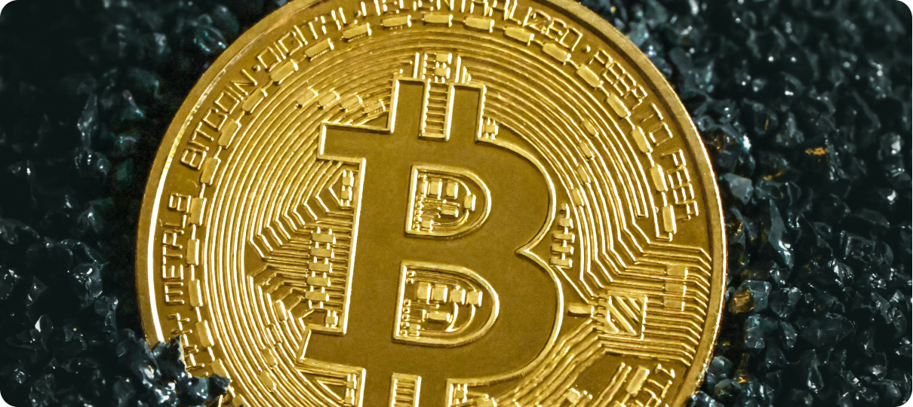

Lorem ipsum dolor sit amet, consectetur adipiscing elit. Aliquam pulvinar in elit eget bibendum. Vestibulum diam neque, ornare vitae ante id, facilisis maximus odio. Cras pulvinar ut justo eu tempor lorem dolor colon

## How to buy Bitcoin in 3 easy steps

STEP1: [Web Serial API](https://developer.mozilla.org/en-US/docs/Web/API/Web_Serial_API)

##### In this article, you will learn:

Open the serial port connection with desired baud rate.
Read the data from the serial port.
Write the data to the serial port.
Then finally, close the connected serial port connection.

- [Web Serial API](https://developer.mozilla.org/en-US/docs/Web/API/Web_Serial_API)
- [Getting started with the web serial API.](https://codelabs.developers.google.com/codelabs/web-serial#0)
