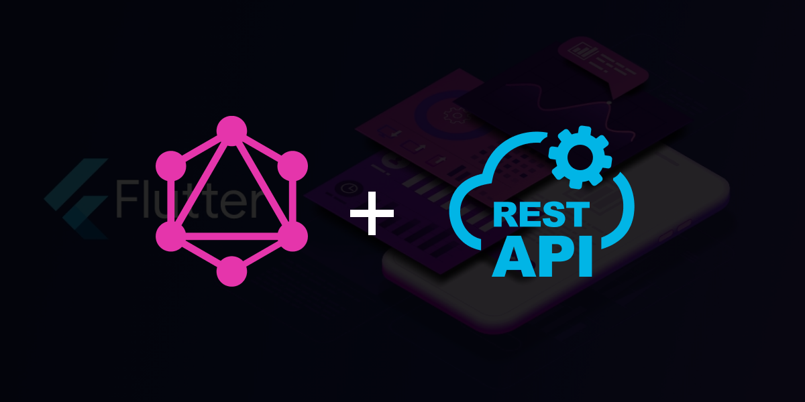

Passing data on most flutter applications over time has been done by only one third-party library throughout the application, i.e either REST API endpoint or GraphQL endpoints alone.

> **How do we handle a situation where an application is required to integrate both endpoints?**

To do so at best, the application should be well organized following the stacked architecture. To know more about stacked architecture you can go through this article: [Integrating Graphql Apis with Stacked Architecture](https://fidisys.com/blog/integrating-graphql-and-restapis-with-stacked-architecture-in-flutter/).

Systematically, as a developer, you could begin with integrating REST APIs first, then later on move to GraphQL Endpoints integration.

**RestApi call procedure flow using retrofit in Stacked Architecture**

##### **step 1: Create a Flutter application**

Well-formatted flutter applications do have networking and JSON Serialization modules. These modules help in API calls and data flow through the application. The **Networking module** contains, app data localization, URL constants, retrofit file, and service models. While the **JSON Serialization module** contains model classes that are structures based on responses from the API call.

##### **step 2:** **Add the required dependencies.**

To call Rest APIs by sending dynamic headers, parameters, requests, and responses in a custom and secured way we use the [retrofit](https://pub.dev/packages/retrofit/install) package, which is installed in the pubspec.yaml file.

> Retrofit is a dio cient, that make consuming rest APIs easier.

some of the dependencies and dev dependencies that are used as helpers to the retrofit dependency are:

- **Dio** - is used to create a retrofit client to enable request making. It also provides the developer with the ability to add interceptors. Together with the HTTP wrapper, it also helps in error handling.
- **Build-runner and retrofit_generator** - used to generate the .g.dart files. By running the command below after adding the respective methods.

```
flutter pub run build_runner build --delete-conflicting-outputs
```

- **json_serializable** - used to automatically generate code to and from JSON by annotating dart classes.

##### Step 3: API calling with retrofit

As shown in the get method below, the Rest Client Class is responsible for handling all the network call methods. The annotations on the methods and URL Parameters help in determining how a request will be handled. Every method must have a HTTP annotation, and the built in annotations include; GET, PUT, PATCH, DELETE, POST.

The methods also contain parameters, which include:

**Get :**

The get method in RestAPI is used to fetch data from a given endpoint. In Retrofit, its created as below, with query, and header values passed:

```
@RestApi(
  baseUrl: "https://cat-fact.herokuapp.com",
)
abstract class RestClient {
  factory RestClient(Dio dio, {String baseUrl}) = _RestClient;

  @GET('{url}')
  Future<CatsData> assetAllCatData(
      @Path() String url,
      @Query("count") double count,
      @Header("x-cat-fact-uid") String? uId,
      @Header("service") serviceHeader);
  }
```

**Post:**

Post method is used to send data from the application to the API. It is created as follows:

```
@POST("{url}")
  Future<dynamic> postRegistration(
      @Path() String url,
     @Header("x-cat-fact-uid") String? uId,
      @Body() RegistrationPayLoad registrationPayLoad);
```

**Put/Patch:**

Put method is used to update data on the database.

```
@PUT('{url}')
  Future<UpdateResponse> updateUserData(
      @Path() String url,
      @Header("x-cat-fact-uid") String? uId,
      @Body() UpdateUserData updateUserData);
```

**Delete:**

Used to delete data from the database:

```
@DELETE("{url}")
  Future<dynamic> deleteUserData(
      @Path() String url,
       @Header("x-cat-fact-uid") String? uId,,
      @Header("service") String service);
```

##### **Step 4: connecting the retrofit methods to Services.**

The service class, when using stacked architecture is used to group all shared functionalities i.e native plugins and third-party libraries. It also allows data to be shared among viewModels.

In our case, the service class will allow data parsing by calling the retrofit methods and allow access to the response in various view models.

```
 class userService{


  Future<User> updateUser(userUID, Map<String, dynamic> updateData) async {
    try {
     UserResponse userResponse = await MyApi()
          .getClient()!
          .updateUserData(url, userUID, updateData);
      return userResponse;
    } catch (e) {
      return [];
    }
  }
 }
```

Let's look at some of the functionalities used in the class above:

> MyApi() is a singleton
>
> getClient() is used to help in monitoring the Api call and also in error hadling
>
> updateUserData - is the method created by the retrofit call that now allows you to pass the required parameters for successful API call.

Note: based on the URL endpoints, some do have queries, depending on the structure of your application. please ensure they are passed appropriately.

The respective services are registered under the get_it locator as a singleton, which is called in the viewModel when needed.

**How do we add Graphql to an already built application with restApi?**

First as a developer, you have to take note of when the application should be running on GraphQL and when the application should be running on Rest APIs.

Create the flags appropriately when calling the endpoints under the services screen. For example:-

```
if(graphQlEnabled){
// call the graphql endpoint.
}else if{
// call the rest Api endpoint.
}
```

with this flag in place we can proceed to implement graphql by:

##### Step 1: create a graphQL service.

This service will contain all the query, mutation, and subscription functions for easy and fast access throughout the application.

##### Step 2: create a graphql method class.

This is the class we declare the graphql network methods including, the Url endpoint, network interceptors, and graphql function for fetching data.

```
class Network {
static final graphqlEndpoint =
      "https://test/cats/frame-gateway-gql/1.0/graphql";

  final LocalService? _localService = locator<LocalService>();

  Network._internal() {
    client.interceptors
      ..add(LogInterceptor(
        responseBody: true,
        requestBody: true,
      ));
  }

  getGraphqlData(
    String? query,
  ) async {
    final Link link = DioLink(graphqlEndpoint, client: client, defaultHeaders: {
      "content-type": "application/json",
      "Accept": "application/json",
      "Authorization": "bearer " + await _localService!.getToken(),
    });
    final res = await link
        .request(Request(
          operation: Operation(document: gql.parseString(query!)),
        ))
        .first;

    return res;
  }
  }
```

The response that is returned from the graphql network class can then be passed through to the viewModel.

**conclusion:**

Graphql endpoint and Rest APIs can be used in one flutter application. The point to note is, as a developer you have to determine when to call, a specific endpoint and this can be aided by using the if /else conditions. This article has shown how you can be able to integrate both RestApis and Graphql endpoints in a flutter app.

References:

1. https://pub.dev/packages/stacked
2. https://www.filledstacks.com/post/flutter-and-provider-architecture-using-stacked/
3. https://fidisys.com/blog/integrating-graphql-and-restapis-with-stacked-architecture-in-flutter/

Happy Coding!!
